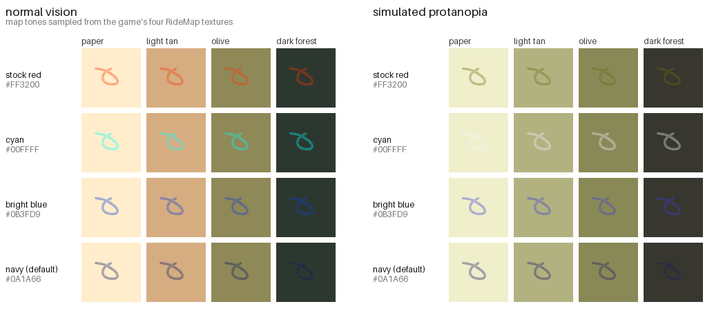

# Colorblind Map Markers — RV There Yet?

Recolors the handheld map's route line and checkpoint markers from red to a
deep blue, so they stay visible for players with red–green color blindness.



## The problem

The map is tan/brown paper, and the game draws the route line and the
checkpoint markers on it in red (`#FF3200`). Red on tan is the worst possible
pairing for **protanopia** — the red-blind form of color blindness. A protanope
loses the L ("red") cone, so red darkens dramatically *and* slides toward the
same yellowish hue as the paper. The markers don't just get harder to see; they
converge on the background.

The bottom row of the image above is that simulation. The stock red circle
becomes a drab khaki that nearly matches the paper.

## Why dark navy, and not cyan

Blue is the right *hue* — the blue–yellow axis is the one protanopes and
deuteranopes keep — but hue alone isn't enough, and the obvious "bright cyan"
choice is actively bad.

The map is not flat tan paper. Decoding all four `TX_RideMap` textures and
measuring them gives a range from cream paper `#FFEDCB` through tan and olive
down to near-black forest `#2C382F`, with a **median luminance of 0.27** — so
most of the map is mid-to-dark. Markers therefore need to be *dark* to stay
readable over the largest share of it:

| color | share of map area keeping ≥3:1 contrast (protanopia-simulated) |
|---|---|
| stock red `#FF3200` | 24% |
| cyan `#00FFFF` | 49% |
| bright blue `#0B3FD9` | 33% |
| **navy `#0A1A66`** *(default)* | **76%** |
| near-black `#141414` | 82% |

Cyan loses because it's nearly as bright as the paper; bright blue loses because
it's too light for the olive and forest tones that cover much of the map. Navy
is dark enough to win on luminance while still reading as unmistakably blue.

No single flat color can be optimal everywhere on a map this varied — the
remaining ~24% is mostly the darkest forest, where a dark marker necessarily
has less contrast. If you'd rather have maximum contrast and don't care about
color coding, the `mono` preset trades the hue away for that last 6%.

## Which maps does this cover?

All of them. There is a single map blueprint (`BP_Interactable_Map`) and a
single set of marker widget classes shared by every level — only the paper
*background* differs per level (`TX_RideMap-02/03/05/06`, with matching
`MM_Map_*` materials). Since the mod recolors the shared widgets and the shared
spline material, it applies everywhere automatically.

The default color was chosen against all four backgrounds at once, not just the
starting one, so it doesn't fall apart on the later maps.

## Requirements

- **RV There Yet?** (Steam)
- **UE4SS** — the experimental build, not the old `v3.0.1` stable release.
  Grab `UE4SS_v3.0.1-<build>.zip` from
  [experimental-latest](https://github.com/UE4SS-RE/RE-UE4SS/releases/tag/experimental-latest).
  The stable release predates UE 5.5 and will not attach to this game.

## Install

1. Install UE4SS: extract the zip into
   `steamapps/common/Ride/Ride/Binaries/Win64/`
   (you should end up with `dwmapi.dll` and a `ue4ss/` folder there).
2. Extract this mod's zip into the same `Win64/` folder. It drops
   `ColorblindMapMarkers` into `ue4ss/Mods/`.
3. Launch the game.

The mod ships an `enabled.txt`, so there's no need to edit `mods.txt`.

### On Linux / Steam Deck (Proton)

Add this to the game's Steam launch options so Proton loads the proxy DLL:

```
WINEDLLOVERRIDES="dwmapi=n,b" %command%
```

## Configuration

Edit `ue4ss/Mods/ColorblindMapMarkers/Scripts/config.lua`. Colors are ordinary
sRGB hex; the mod converts them to UE's linear space for you.

```lua
config.preset = "protan"   -- "protan" | "deutan" | "tritan" | "mono" | "custom"
```

| preset | for |
|---|---|
| `protan` | protanopia / protanomaly (red-blind) — **default** |
| `deutan` | deuteranopia / deuteranomaly (green-blind) |
| `tritan` | tritanopia (blue-blind) — uses deep red, avoids blue |
| `mono` | no hue reliance at all; maximum luminance contrast |
| `custom` | your own colors, from `config.custom` |

Each palette sets three colors independently:

- `route` — the tracking line drawn across the map
- `marker` — checkpoint, campsite and exit markers
- `player` — your own RV's position marker

Other options: `refresh_ms` (how often to re-apply, default 1000),
`recolor_player_marker` (default true), `recolor_labels` (default true — the
"CAMP SITE" / "EXIT TO ROUTE 65" captions also ship red), and `verbose` logging
to `UE4SS.log`.

## How it works

The game doesn't bake red into its artwork, which is what makes this mod small:

- The marker icons (`TX_MapMarker_NextCheckpoint`, `TX_MapMarker_OldCheckpoint`,
  `TX_MapMarker_Truck`) are **pure white line art**, tinted at runtime by the
  `WG_Map_*` UMG widgets.
- The route line is a spline mesh (`SM_TrackingSplineMesh`) using material
  `MM_MapMarker`, which exposes a `Color` vector parameter.

So the mod never touches packaged assets. It finds the live objects and
restates those two values:

- `SetVectorParameterValueOnMaterials("Color", …)` on each spline mesh segment
- the brush/tint color on each `Border`, `Image` and `TextBlock` inside the
  marker widgets

Two details matter here. The marker widgets wrap their icon in an **outer
`Border` that is fully transparent** and used only for layout — recoloring that
paints a solid square across the map, so the mod reuses each widget's existing
alpha and skips anything invisible. And the game rewrites marker colors while
you pan the map, so besides the timer the mod **post-hooks** the blueprint
functions that do the rewriting (`UpdateCheckpointVisuals`, `SetupWidgets`,
`ConstructSplineMesh`, `SetOldCheckpoint`) to get the last word. Each hook is
optional; a renamed function in a future patch degrades to timer-only rather
than breaking the mod.

There's a third subtlety: the game **fades some markers in** when you open the
map, animating the very color property the mod wants to write. Writing mid-fade
means the mod and the animation fight over the value, and the marker ends up
appearing only intermittently. So the mod only writes to a widget that is either
fully opaque or whose alpha has held steady across a short settle window —
anything still animating is skipped and picked up on a later pass.

Because it's a runtime tint rather than an asset replacement, it needs no
repacked `.pak`, survives game patches that don't rename these objects, and
won't conflict with mods that aren't fighting over the same values.

It re-applies on a 1 s timer, since the game rebuilds the spline line and
respawns marker widgets as you drive and as checkpoints change.

## Uninstall

Delete `ue4ss/Mods/ColorblindMapMarkers/`. To remove UE4SS as well, delete
`dwmapi.dll` and the `ue4ss/` folder from `Ride/Binaries/Win64/`.

## Development

The repo uses a nix flake + direnv for tooling (Rust for
[retoc](https://github.com/trumank/retoc), Python, ImageMagick, LuaJIT):

```sh
direnv allow          # or: nix develop
./scripts/install.sh  # install UE4SS + the mod into a local game install
./scripts/package.sh  # build dist/ColorblindMapMarkers-<version>.zip
luajit tests/load_test.lua   # load the mod against stubbed UE4SS globals
```

`scripts/utoc_index.py` lists a UE5 IoStore `.utoc` (header + directory index
only, so it needs no Oodle) and prints the chunk IDs that `retoc get` wants.
`scripts/ue_texture.py` wraps an inline texture mip in a `.dds` header so
ImageMagick can decode it. `scripts/preview.py` renders the image at the top.

## Credits

- [UE4SS](https://github.com/UE4SS-RE/RE-UE4SS) — the scripting runtime this
  mod is built on.
- [retoc](https://github.com/trumank/retoc) — used during development to read
  the game's IoStore container.

Dichromat simulation uses the standard Viénot/Brettel LMS matrices.

## License

MIT — see [LICENSE](LICENSE). This mod contains no game assets.
